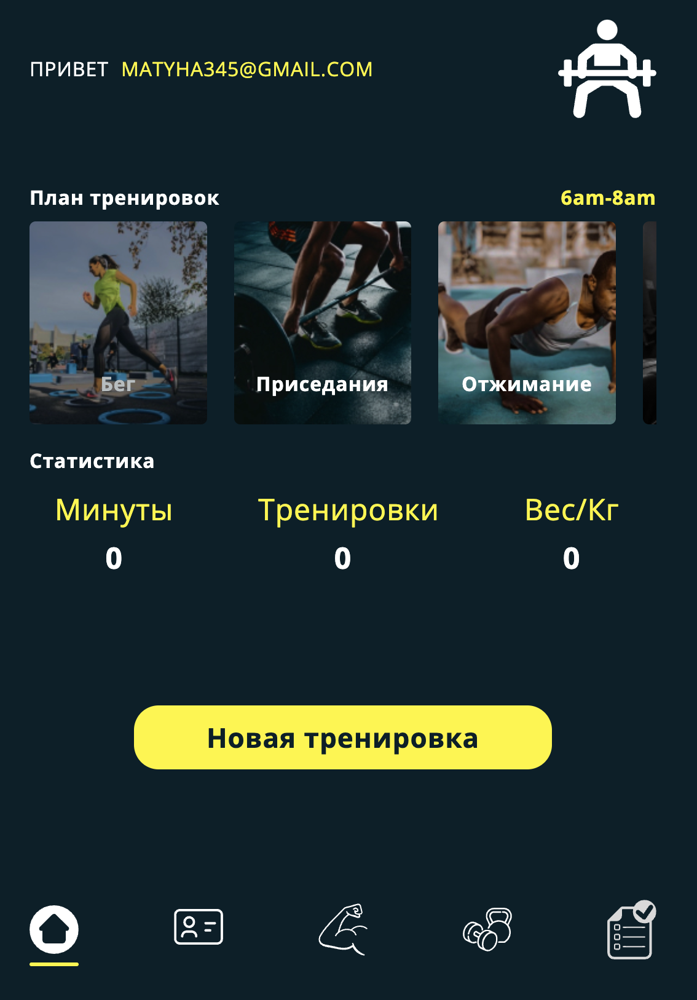

Workout App v2

<h1 color="#fff50a">Добро пожаловать в репозиторий Workout App v2!</h1>

Описание:
Workout App v2 - это вторая версия данного приложения, предназначенного для помощи вам в поддержании здорового образа жизни и достижении ваших фитнес-целей.

Основные зависимости:

Fancyapps UI - Версия ^5.0.20
Tanstack React Query - Версия ^4.32.0
Axios - Версия ^1.4.0
Clsx - Версия ^2.0.0
History - Версия ^5.3.0
Include Media - Версия ^2.0.0
JS Cookie - Версия ^3.0.5
React - Версия ^18.2.0
React DOM - Версия ^18.2.0
React Hook Form - Версия ^7.45.2
React Icons - Версия ^4.10.1
React Router DOM - Версия ^6.14.2
React Select - Версия ^5.7.4
Sass - Версия ^1.63.6
Swiper - Версия ^10.0.4

Зависимости разработки:

@types/react - Версия ^18.2.14
@types/react-dom - Версия ^18.2.6
@vitejs/plugin-react - Версия ^4.0.1
ESLint - Версия ^8.44.0
ESLint Plugin React - Версия ^7.32.2
ESLint Plugin React Hooks - Версия ^4.6.0
ESLint Plugin React Refresh - Версия ^0.4.1
Prettier - Версия 3.0.0
Vite - Версия ^4.4.0
Установка:

Убедитесь, что у вас установлен Node.js.
Склонируйте репозиторий: git clone https://github.com/ваш-пользователь/workout-app-v2.git
Перейдите в директорию проекта: cd workout-app-v2
Установите зависимости: npm install
Скрипты:

npm run dev - Запуск приложения в режиме разработки с использованием Vite.
npm run build - Сборка проекта с помощью Vite.
npm run preview - Предварительный просмотр собранного проекта с помощью Vite.
Если вы заинтересованы внести свой вклад в развитие Workout App v2, не стесняйтесь клонировать репозиторий и создавать Pull Request'ы. Мы с нетерпением ждем вашего участия!

Автор
Имя: Nikolay_Matyukhin_matyha345
Электронная почта: matyha345@gmail.com

